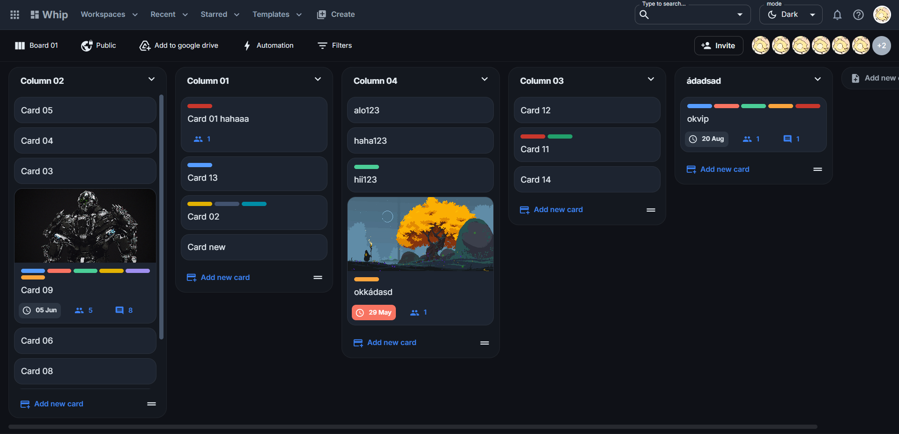
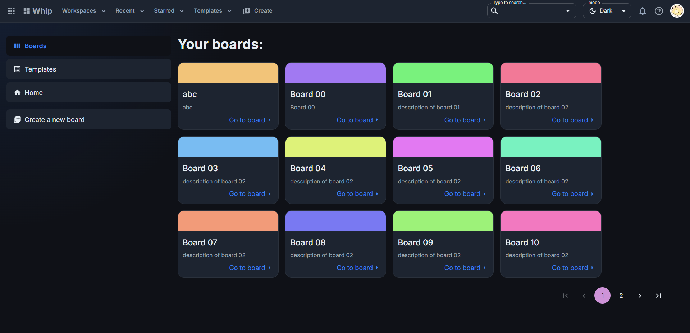
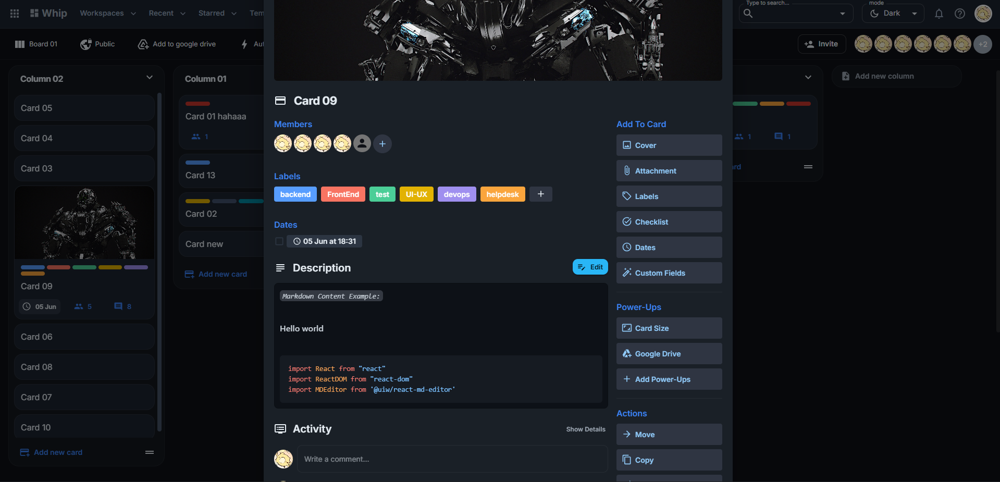

# 🚀 Whip App


## 🎯 Introduction
Whip App is an intuitive, high-performance task management application featuring a seamless drag-and-drop interface. Designed to help developers organize tasks, boards, and cards efficiently, it offers a modern, lightweight, and superior alternative to traditional project management tools.

## 🛠 Tech Stack
This project is built using modern and robust technologies:
- **Core:** React 18
- **Bundler:** Vite (for lightning-fast development server start times ⚡)
- **Styling/UI:** Material UI (MUI v5) & Emotion
- **State Management:** Redux Toolkit & Redux Persist
- **Drag & Drop:** `@dnd-kit` for a smooth interaction experience
- **Routing:** React Router v6

## 🔥 Key Features
The core functionalities that make this application stand out:
- 🎨 **Modern Interface:** A sleek and highly responsive UI built with MUI components.
- 🚀 **Blazing Fast Rendering:** Powered by Vite for optimal performance.
- 🖱️ **Fluid Drag & Drop:** Seamlessly move tasks between columns with a highly optimized drag-and-drop system.
- 💾 **State Persistence:** Never lose your ongoing work, even after refreshing the page, thanks to Redux Persist.

## 🚀 Getting Started
Follow these instructions to set up the project locally:

```bash
# 1. Clone the repository
git clone <repo-url>

# 2. Navigate to the project directory
cd whip-app

# 3. Install dependencies
npm install

# 4. Start the development server 🚀
npm run dev
```

## ⚙️ Environment Variables
(Currently, the application can run without complex environment variables. For API connection configurations, you can create a `.env` file referencing the backend team's specifications.)

## 📸 Demo & Screenshots
Here is a preview of the Whip App interface:

### Board Interface


### Card Detail Interface


### Home Interface


## 🤝 Contributing & License
- **Contributing:** Contributions are welcome! Please fork this repository, create a new branch, and submit a Pull Request (PR). Ensure your code follows the project's coding standards.
- **License:** Distributed under the MIT License. Feel free to use, clone, and modify!
