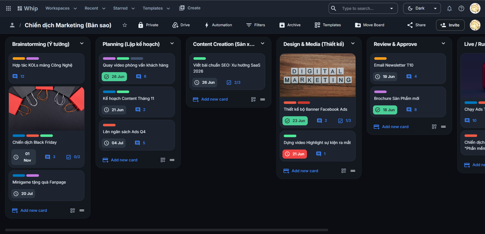
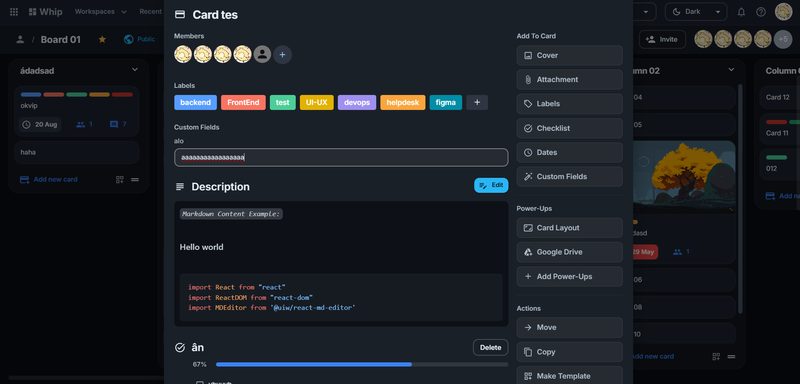
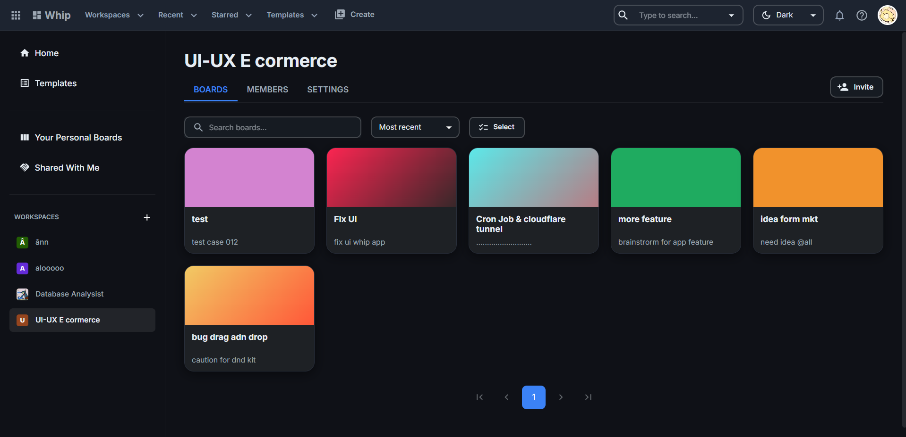
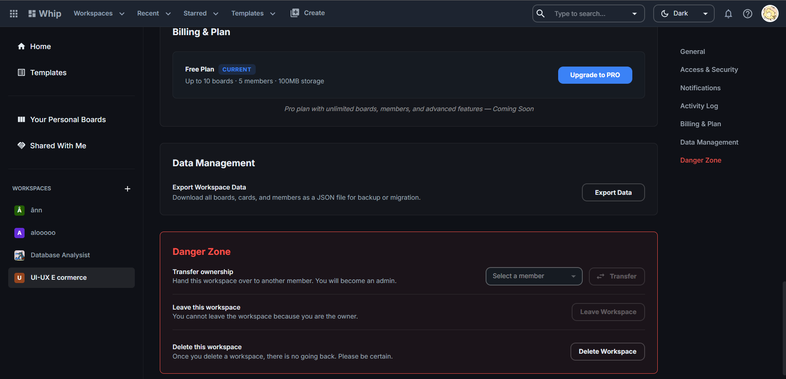

# 🚀 Whip App


      

## 🎯 Introduction
Whip App is a modern, real-time project management application — a Trello-style Kanban workspace with a seamless drag-and-drop experience. It helps teams organize work across workspaces, boards, and cards, with rich collaboration features like comments, @mentions, live notifications, and role-based access control. Built for speed with React 18 + Vite and a polished Material UI interface.

> This is the **frontend** of the Whip project. It talks to the **Whip API** backend (separate repository).

## 🛠 Tech Stack
- **Core:** React 18 + Vite 5 (lightning-fast dev server ⚡)
- **UI:** Material UI (MUI v5) & Emotion — with dark/light mode
- **State:** Redux Toolkit & Redux Persist
- **Drag & Drop:** `@dnd-kit` for a smooth, accessible board experience
- **Routing:** React Router v6
- **Real-time:** Socket.io Client (live comments & notifications)
- **Forms & Content:** React Hook Form, `@uiw/react-md-editor` (Markdown), Day.js
- **Auth & UX:** Google OAuth (`@react-oauth/google`), Sonner (toasts), Material UI Confirm

## 🔥 Key Features

**🏢 Workspaces & Collaboration**
- Multiple workspaces with role-based access — **Owner / Admin / Member**
- Invite members by email, transfer ownership, leave or delete a workspace
- Per-member notification preferences

**📋 Boards & Kanban**
- Fluid drag-and-drop of columns and cards
- Board visibility: **Private / Public / Workspace-visible**
- Board & card templates, archiving, favorites (starred), move board
- Global board search + in-workspace search & sorting

**🗂️ Rich Cards**
- Labels, checklists, due dates, cover images, attachments (Cloudinary)
- Custom fields, card members, and a Markdown description editor
- Comments & threaded replies with **@mention autocomplete**
- Per-card activity log

**🔔 Real-time & Notifications**
- Live comments and notifications via Socket.io
- In-app **and** email notifications (mentions, board created/deleted, member joins)
- Notification bell with unread count, mark-as-read, and dismiss

**✨ Experience**
- Dark / Light theme
- State persistence with Redux Persist — never lose your work on refresh
- Google sign-in

## 🚀 Getting Started
Follow these instructions to set up the project locally:

```bash
# 1. Clone the repository
git clone <repo-url>

# 2. Navigate to the project directory
cd whip-app

# 3. Install dependencies
npm install

# 4. Start the development server 🚀
npm run dev
```

The app connects to the backend automatically based on `BUILD_MODE` (`dev` / `production`), so no API URL configuration is required.

## ⚙️ Environment Variables
Only needed for social login. Create a `.env` file in the root:

```env
VITE_GOOGLE_CLIENT_ID='<your-google-oauth-client-id>'
VITE_GITHUB_CLIENT_ID='<your-github-oauth-client-id>'
```

The GitHub OAuth App callback URL must be exactly `<frontend-origin>/login`. Use the client ID that matches the backend GitHub credentials for each environment (local and production).

## 📸 Demo & Screenshots
A preview of the Whip App interface:

### Board (Kanban) Interface


### Card Detail


### Workspace Dashboard


### Workspace Settings


## 🤝 Contributing & License
- **Contributing:** Contributions are welcome! Please fork this repository, create a new branch, and submit a Pull Request (PR). Ensure your code follows the project's coding standards.
- **License:** Distributed under the MIT License. Feel free to use, clone, and modify!
